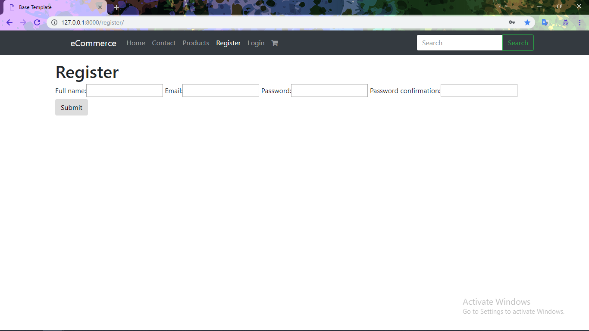
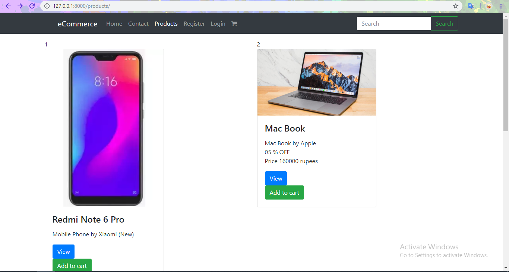
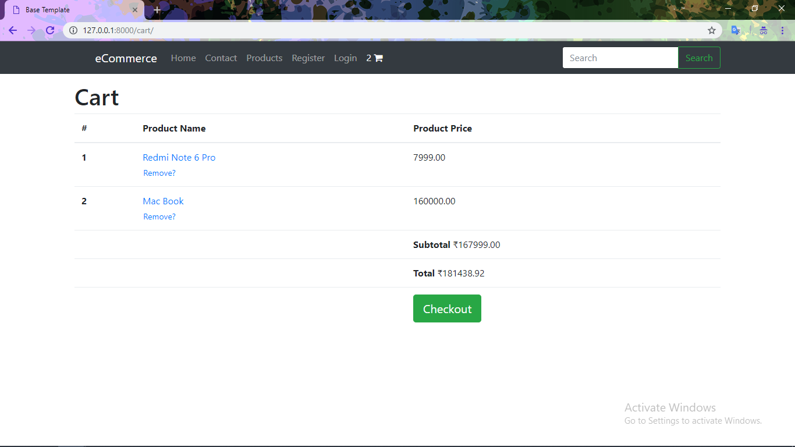
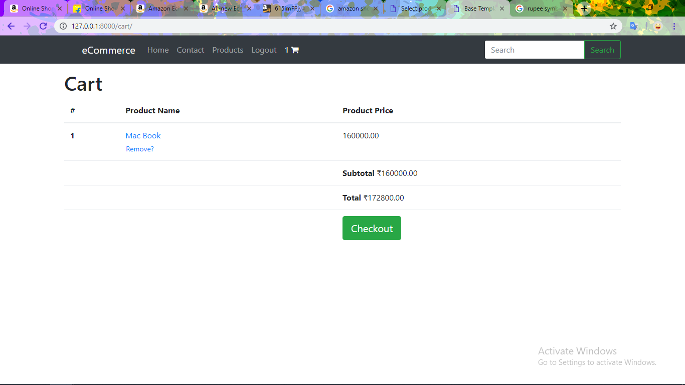
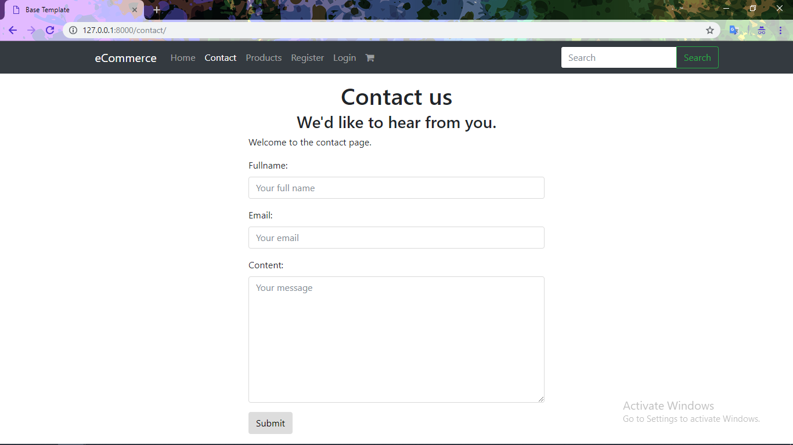

# Online-Shopping
## A Python e-commerce web application.

### Key features of website
- Homepage
- Register
- Login
- Products
- Search
- Shopping Cart
- Checkout
- Catalogue
- Payment
- Order Confirmation
- Contact
- Administration
- REST API

##### 1. Homepage of Website

---

2. Register

---

3. Login

---

4. Products

---

5. More Products

---

6. View Product

---

7. Add to Cart

---

8. Checkout

---

9. Add Shpping Address

---

10. Add Shpping Address

---

11. Do Final Checkout

---

12. Do Payment

---

13. Order Confirmation

---

14. Contact for Help

