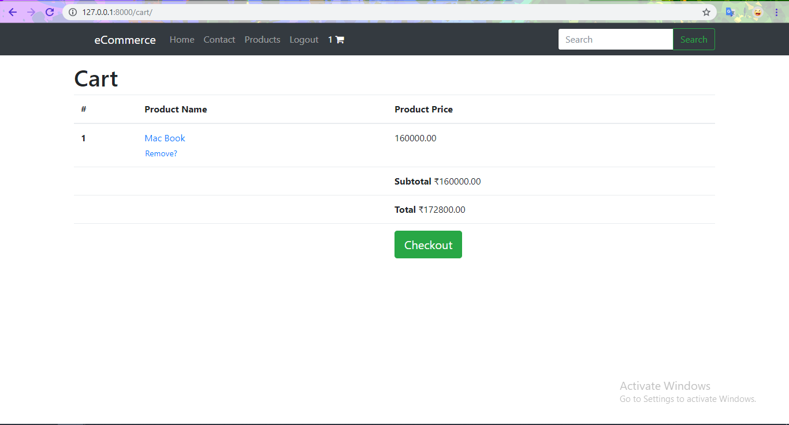

Alt-H1 Online-Shopping
Alt-H2 A Python e-commerce web application.

Alt-H3 Key features of website
- Homepage
- Register
- Login
- Products
- Search
- Shopping Cart
- Checkout
- Catalogue
- Payment
- Order Confirmation
- Contact
- Administration
- REST API

Alt-H4 1. Homepage of Website

---

Alt-H4 2. Register

---

Alt-H4 3. Login

---

Alt-H4 4. Products

---

Alt-H4 5. More Products

---

Alt-H4 6. View Product

---

Alt-H4 7. Add to Cart

---

Alt-H4 8. Checkout

---

Alt-H4 9. Add Shipping Address

---

Alt-H4 10. Add Billing Address

---

Alt-H4 11. Do Final Checkout

---

Alt-H4 12. Do Payment

---

Alt-H4 13. Order Confirmation

---

Alt-H4 14. Contact for Help

---

Alt-H4 15. Contact Confirmation

